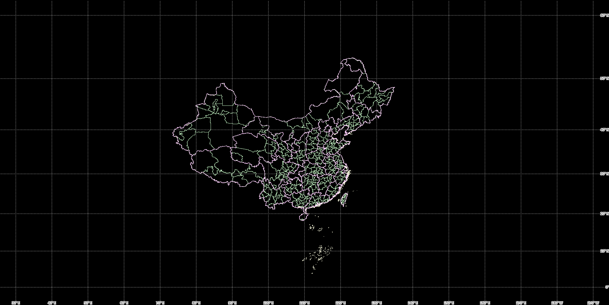

# gis-web-server-demo
GIS Web Server with shapefile - 使用 shapefile 的地理信息系统 Web 服务

## Viewer Demo - OpenLayers with React



```typescript
import { useEffect, useRef } from 'react';
import './App.css'; 
import { Property } from "csstype"

import Map from 'ol/Map';
import XYZ from 'ol/source/XYZ';
import TileLayer from 'ol/layer/Tile';
import View from 'ol/View';
import Graticule from 'ol/layer/Graticule.js';
import Stroke from 'ol/style/Stroke.js';
import {fromLonLat} from 'ol/proj.js';
import "ol/ol.css";

function App() {
  
  const mapStyle = {
    position: 'absolute' as Property.Position,
    top: 0,
    bottom: 0,
    width: "100%",
  };

  const mapDivRef = useRef<HTMLDivElement>(null);
  const mapRef = useRef<Map|null>(null);

  useEffect(() => {
    if (mapDivRef.current) {
      mapRef.current = mapRef.current ?? new Map({
        target: mapDivRef.current,

        layers: [
          new TileLayer({
            source: new XYZ({  
              url: 'http://localhost:1995/maps/{z}/{x}/{y}.png',       
              wrapX: true,
            }),
          }),

          new Graticule({
            strokeStyle: new Stroke({
              color: 'gray',
              width: 2,
              lineDash: [0.5, 4],
            }),
            showLabels: true,
            wrapX: true,
          }),
        ],

        view: new View({
          center: fromLonLat([110, 35]),
          zoom: 4,
        }),
      });
    }

  }, []);

  return (
    <div ref={mapDivRef} style={mapStyle}/>
  );
}

export default App;
```